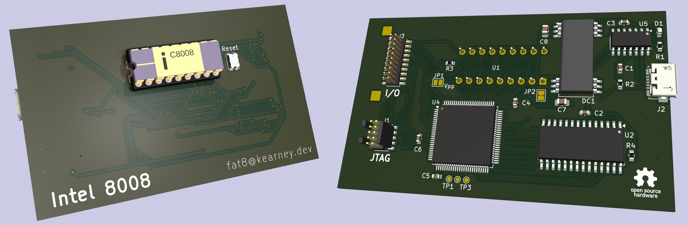

# fat8
A physically tiny, but fat in capability Intel 8008 SBC.  Smaller than a business card although quite a bit thicker.

This is not pure vintage design, rather its intent is to keep the flavor of one by pairing a real 8008 CPU with its maximum RAM footprint as a vehicle for running larger software like Scelbi's SCELBAL and GALAXY, emulators, and other fun projects.

- 8008 CPU running at ~ 50K instructions per second.
- 32KB of nonvolatile RAM (16KB addressable at a time)
- Connects to a PC as a USB serial terminal
- 3 input and 3 output ports available on an expansion connector
- Machine-level monitor program
- Prebuilt images for SCELBAL and GALAXY

[Hardware page](hardware/)\
[Software page](software/)\
[Tools page](tools/)

## Operation

1. Connect to USB
2. Open serial terminal program, for example minicom
3. Select the new port (probably /dev/ttyACM0) and set for to 2400 8N1
4. Press 'Reset' button
5. You should see the monitor prompt.  Press '?' for a list of commands.

## Licenses

Software and tools : [BSD-3-Clause](LICENSE.BSD-3-Clause)\
Hardware and CPLD programming : [CERN Open Hardware Licence Version 2 - Weakly Reciprocal](LICENSE.CERN-OHL-W-2.0)

SPDX-License-Identifier: BSD-3-Clause\
SPDX-License-Identifier: CERN Open Hardware Licence Version 2 - Weakly Reciprocal
